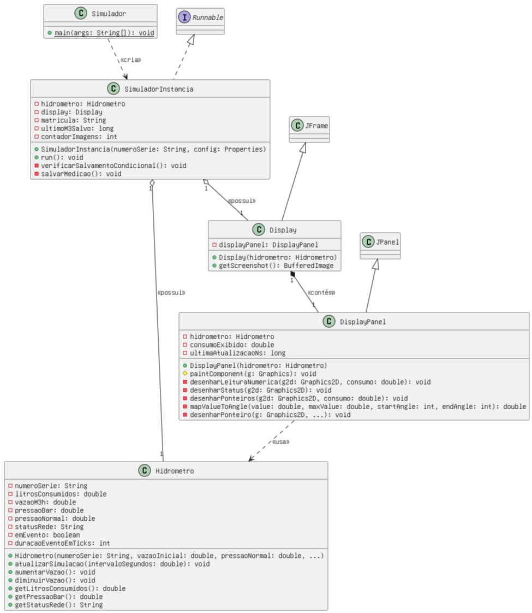
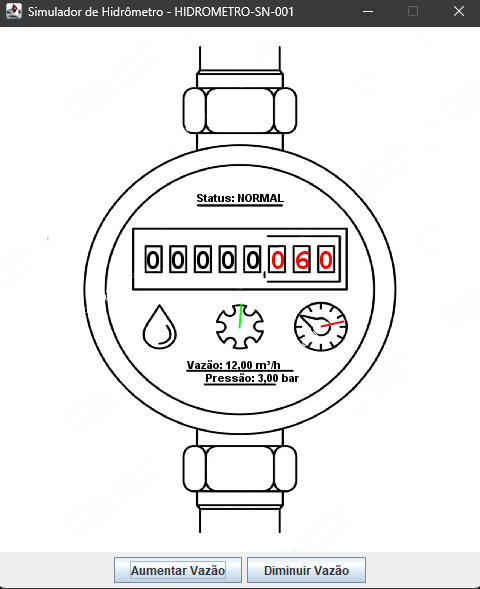

# Simulador de Hidrômetro Interativo v2.0

## Descrição

Este projeto é um software em Java que simula o funcionamento de um hidrômetro através de uma interface gráfica (GUI) interativa e multithread. Desenvolvido como uma evolução de uma versão anterior, este simulador permite que o usuário controle a vazão de água em tempo real sem interromper a execução, servindo como um componente visual para testes e demonstrações.

O sistema é capaz de rodar múltiplas instâncias de simulação de forma independente e simultânea, onde cada uma exibe dados de consumo, vazão e pressão, além de simular eventos da rede como falta de água e ar na tubulação.

**Aluno proprietário:** Arthur Siqueira 

**Aluno colaborador:** Cefras Mandú 

## Funcionalidades Principais

* **GUI Interativa com Animação:** Exibe todos os dados da simulação em uma janela gráfica com uma imagem de fundo customizada. A interface contém ponteiros animados que representam visualmente a leitura de consumo e as variações de pressão em tempo real.
* **Simulação Detalhada:** O sistema simula de forma contínua e dinâmica o consumo de água ($m³$), a vazão ($m³/h$) e a pressão (bar) da rede.
* **Controle em Tempo Real:** O usuário pode aumentar ou diminuir a vazão da água através de botões na interface enquanto a simulação está em execução.
* **Simulação de Eventos da Rede:** O simulador é capaz de emular eventos aleatórios de falta de água (zerando a vazão e pressão) e a presença de ar na tubulação, que causa uma medição incorreta do volume.
* **Configuração Externa:** Parâmetros chave da simulação (vazão inicial, pressão, probabilidades de eventos, etc.) são lidos a partir de um arquivo externo `parametros.properties`, permitindo fácil ajuste sem a necessidade de recompilar o código.
* **Salvamento Automático de Medições:** A cada metro cúbico ($m³$) de água consumido, o sistema salva automaticamente uma imagem (screenshot) da interface em formato JPEG. As imagens são organizadas em um diretório específico (`Medições_[MatriculaSUAP]`) com nomes de arquivo cíclicos (01.jpeg a 99.jpeg).
* **Execução Multithread:** O simulador pode instanciar e executar até 5 simulações simultaneamente, cada uma em sua própria thread e janela, com comportamentos de medição e saída completamente independentes.

## Arquitetura do Sistema

A arquitetura do sistema foi reestruturada para suportar as novas funcionalidades e a execução multithread. As classes principais são:

* **`Simulador`**: Classe principal que serve como ponto de entrada (`main`). É responsável por solicitar ao usuário a quantidade de simulações e por iniciar as threads `SimuladorInstancia`.
* **`SimuladorInstancia`**: Encapsula uma simulação completa e independente. Cada instância possui seus próprios objetos `Hidrometro` e `Display` e roda em uma thread separada.
* **`Hidrometro`**: O motor da simulação[. Gerencia todos os cálculos de consumo, vazão e pressão, além de controlar o sistema de eventos (falta de água, ar na tubulação) e a flutuação mecânica para maior realismo.
* **`Display`**: A janela da interface gráfica (`JFrame`). Contém o painel de desenho e os botões de controle.
* **`DisplayPanel`**: Painel customizado (`JPanel`) responsável por todo o desenho visual: a imagem de fundo, os ponteiros animados e a leitura numérica formatada. Utiliza um `javax.swing.Timer` para garantir animações fluidas a ~60 FPS.

## Diagrama de Classes (UML)



## Interface Gráfica (GUI)



## Como Executar o Projeto

### Pré-requisitos

* Java 11 ou superior instalado.
* Apache Maven para gerenciamento do projeto.

### Passos

1.  **Configure a Simulação:**
    * Abra o arquivo `src/main/resources/parametros.properties`.
    * Ajuste os valores de `vazao.inicial.m3h`, `pressao.normal.bar`, e as probabilidades dos eventos conforme desejado.
    * Certifique-se de preencher o campo `matricula.suap` para o correto salvamento das medições.

2.  **Adicione a Imagem de Fundo:**
    * Coloque a imagem de fundo da interface no diretório `src/main/resources/`.
    * O arquivo deve ser nomeado como `background.png`.

3.  **Compile e Execute:**
    * Navegue até a raiz do projeto pelo terminal.
    * Compile o projeto usando o Maven:
        ```sh
        mvn clean install
        ```
    * Execute a classe principal `Simulador`:
        ```sh
        mvn exec:java -Dexec.mainClass="br.com.cefras.hidrometro.Simulador"
        ```
    * O programa irá solicitar no console a quantidade de hidrômetros que você deseja simular (1 a 5). Digite o número e pressione Enter.